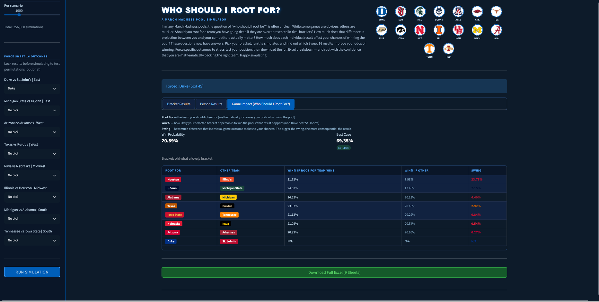
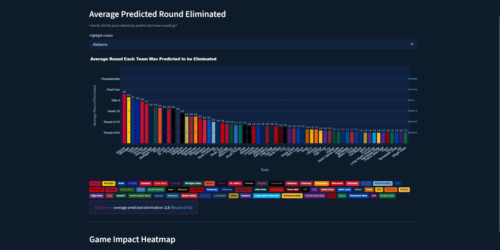

# Who Should I Root For? — March Madness Pool Simulator

> *A full-stack data project combining SQL Server, Monte Carlo simulation, and an interactive Streamlit dashboard to answer the most important question in any March Madness pool.*

> **Live demo (Sweet 16):** [march-madness-simulator-elro.streamlit.app](https://march-madness-simulator-elro.streamlit.app) *(hosted on Streamlit Community Cloud — no setup required)*
>
> **Live demo (Elite 8):** [march-madness-simulator-elite8-elro.streamlit.app](https://march-madness-simulator-elite8-elro.streamlit.app) *(updated model with Elite 8 matchups and revised KenPom ratings)*


---

## Overview

In many March Madness bracket pools, the question of **"who should I root for?"** is surprisingly unclear. While some games are obvious — you'll always cheer for your champion pick — others are murkier. Consider some of the scenarios you might face:

- You picked a team to make the Final Four, but a quarter of your pool has them going to the Finals — do you actually want them to win their Sweet 16 matchup?
- Half the people who picked the same champion as you have them going even further — what does that do to your odds?
- You have multiple brackets with conflicting picks — which result are you actually rooting for?
- Your predicted winner already busted, so you have neither team going through in a given game — who on earth do you cheer for?
- You have a niche Final Four pick who happens to be on the same side of the bracket as your champion, playing a weak team that would make your champion's path much easier — do you root for the upset or against it?

I could go on. The point is there are simply too many variables — overlapping picks, rival brackets, path dependencies, multi-bracket strategies — that make it genuinely impossible to consistently answer the "who do I root for?" question accurately through intuition alone.

Which is why this project answers it mathematically.


Built around my real-life March Madness pool of 25 brackets, the simulator uses KenPom adjusted efficiency margin to run tens of millions of hypothetical matches across millions of hypothetical tournaments — including tens of thousands of simulations for every possible permutation of Sweet 16 results. It calculates win probabilities for each bracket under each scenario and tells you exactly which result improves your odds of winning, and by how much.

Now you can finally root with confidence, knowing you are mathematically backing the right team.

---

## Screenshots

> *Dashboard — Simulator*



> *Visualisations — Bust Analysis & Biggest Upsets*



---

## The Dashboard

The project ships as a two-page interactive Streamlit web app in two versions:

| Version | Description | How to access |
|---|---|---|
| **Full version** (`dashboard.py`) | Connects to a local SQL Server database. Full read/write capability — update results, run the simulation engine, export Excel | Run locally with `streamlit run dashboard.py` |
| **Demo version** (`dashboard_demo.py`) | Reads from bundled CSV files. Identical UI and simulation engine — no database required | [Live on Streamlit Cloud](https://march-madness-simulator-elro.streamlit.app) or run locally with `streamlit run dashboard_demo.py` |

The demo version is functionally identical to the full version for everything a visitor needs — the simulation engine, all visualisations, Excel export, and forced outcome analysis all work exactly the same. The only difference is the data source.

### Page 1 — Simulator

The main page is built around the simulation engine. It is designed to answer one question as directly as possible: *for a given bracket, which Sweet 16 games matter most to your chances of winning the pool?*

**Sidebar controls:**
- **Perspective toggle** — switch between bracket-level analysis (one bracket's position) and person-level analysis (combined probability across multiple brackets)
- **Bracket / person selector** — choose which bracket or person to analyse
- **Simulation count** — set simulations per scenario (500 to 10,000). At 1,000 sims the full run completes in ~8 seconds; at 10,000 in ~80 seconds
- **Force Sweet 16 outcomes** — lock specific game results before running to model hypothetical scenarios. *"If Michigan wins, how does my position change?"*

**Results tabs:**

| Tab | What it shows |
|---|---|
| Bracket Results | Every bracket ranked by win probability, with best and worst case ranges |
| Person Results | Every person ranked by combined win probability across all their brackets |
| Game Impact | The key table — each Sweet 16 game ranked by how much its outcome shifts your win probability. The "Root For" team is always the one that helps you. |

Gold row highlighting tracks your selected bracket or person across all tables, and cross-highlights the corresponding person when a bracket is selected (and vice versa).

**Excel download** — a full 9-sheet Excel file is generated on demand and available for download after each simulation run.

---

### Page 2 — Visualisations

A separate visualisations page provides a more intuitive, chart-based view of the pool data — useful for sharing with friends who want the narrative without the numbers.

| Chart | Description |
|---|---|
| Who Did the Pool Predict? | Select any matchup (Round of 64 through Championship) and see a pie chart of how the pool split, in team colours |
| Bust Analysis | Pie chart showing which teams first busted each bracket, plus a table showing every bracket ordered by how long they survived |
| Biggest Upsets | Horizontal bar chart of the 5 least-predicted results that actually happened, with brackets that called it listed |
| Average Predicted Round Eliminated | Bar chart showing how far the pool collectively expected each of the 64 teams to go. Highlight any team to see their exact average |
| Game Impact Heatmap | Once the simulator has been run on Page 1, a heatmap shows which Sweet 16 games matter most to which brackets — colour coded from cool blue (low impact) to hot red (high impact) |
| Champion Pick Breakdown | Pie chart of championship picks across all 25 brackets, in team colours |

> **No setup required** — visit the [live demo](https://march-madness-simulator-elro.streamlit.app) to interact with the full simulator in your browser.

---

## Tech Stack

| Layer | Technology |
|---|---|
| Database | SQL Server (local via SSMS) |
| Query Layer | pyodbc + raw SQL |
| Simulation Engine | Python — NumPy, pandas |
| Web App | Streamlit |
| Charts | Plotly |
| Excel Export | openpyxl |

---

## Sample Output — Excel File

A pre-generated baseline Excel file (`simulation_baseline.xlsx`) is included in this repository. No setup or code execution required to see what the simulator produces — just download and open it.

The file is generated at 50,000 simulations per scenario (12,800,000 total simulations) and contains **9 sheets**:

| Sheet | Contents |
|---|---|
| Index | Navigation page with definitions and methodology summary |
| Bracket Summary | Win probability, best case, worst case and range for every bracket |
| Person Summary | Combined win probability per person (for multi-bracket entrants) |
| Swing Analysis | Per-bracket breakdown of how each Sweet 16 game shifts their odds |
| Swing Analysis (By Person) | Same as above, aggregated at person level |
| Game Impact Per Bracket | Each game ranked by importance for each bracket individually |
| Game Impact Per Person | Each game ranked by importance per person |
| Overall Game Impact | Pool-wide ranking of which games matter most |
| All 256 Scenarios | Every possible Sweet 16 outcome with win probabilities, colour-coded by impact |

### Forcing Results

The simulator also supports **forced outcomes** — locking specific Sweet 16 results before running to stress-test your position. For example, *"Assuming Michigan wins their Sweet 16 game, what are my chances?"* This generates a new Excel file with all 9 sheets recalculated under the forced scenario, making it easy to compare your position across different hypothetical tournament paths.

```bash
# Force specific outcomes from the command line
python simulation_3_2.py --sims 50000 --force "55:Michigan" --force "51:Arkansas"
```

Forced games are highlighted in gold in the Excel output. Swing values for forced games display as N/A since there is no alternative outcome to compare against.

---

## Methodology

### 1. Database Design

#### Why SQL Server?

The first design decision was whether to store data in flat files (CSVs) or a relational database. A relational database was chosen for several reasons:

- **Referential integrity** — foreign key constraints ensure no bracket prediction can reference a team or slot that doesn't exist. This eliminates a whole class of silent data errors that flat files cannot prevent.
- **Query flexibility** — complex questions like "which brackets have the most correct Sweet 16 picks?" or "which team eliminated the most brackets?" are trivial in SQL but painful in pandas on flat files.
- **Scalability** — adding a second year's tournament, a new bracket, or a new data source requires only an INSERT, not restructuring the entire data pipeline.
- **Portfolio signal** — most data science projects skip the database entirely and work from CSVs. Building a proper normalised schema demonstrates full-stack thinking that goes beyond modelling.

#### Schema Design — the `mm` schema

All tournament data lives in the `mm` (March Madness) schema. The core tables are:

```
mm.Teams                  — 64 teams with seed, region, and team_id
mm.Tournament_Slots       — 63 slots representing every game in the bracket
mm.Bracket_Contestants    — 25 brackets with predicted champion
mm.Bracket_Predictions    — 1,575 rows (25 brackets × 63 predictions each)
mm.Team_Strengths         — KenPom ratings and Kalshi market probabilities
```

#### Why a slot-based design?

The tournament bracket is a **complete binary tree with 63 nodes**. Rather than storing games as `(team_a, team_b, round, region)` tuples — which would require rebuilding the tree structure every time — each game is assigned a permanent `slot_id` that encodes its position in the bracket.

This design has three key advantages:

1. **Deterministic bracket traversal** — given any slot, the simulator knows exactly which two slots feed into it. Slot 57 always receives the winners of slots 49 and 50. This makes forward propagation through the bracket trivial without any round-by-round lookup logic.

2. **Prediction storage** — each bracket's 63 predictions are stored as `(bracket_id, slot_id, predicted_winner_id, predicted_loser_id)`. Scoring a bracket is then a single GROUP BY query joining predictions to actual results — no bracket-specific logic required.

3. **Stable identifiers** — slot IDs never change even as actual teams are filled in. A prediction made before the tournament starts for "whoever wins slot 49" remains valid and queryable throughout the tournament.

#### Normalisation decisions

The schema is in **Third Normal Form (3NF)**:

- Team names are stored once in `mm.Teams` and referenced everywhere by `team_id`. If a team name needed correcting (this happened several times during data entry), one UPDATE fixes it everywhere.
- Bracket metadata (name, creator, champion pick) is separated from predictions. This means bracket-level queries don't need to scan 63 prediction rows per bracket.
- Potential points per round are stored on `mm.Tournament_Slots` rather than hardcoded in the application. Changing the scoring system requires one SQL UPDATE, not a code change.

#### Views

Six SQL views materialise the most commonly queried joins:

| View | Purpose |
|---|---|
| `mm.vw_Predictions` | All predictions with team names, actual results, and points earned |
| `mm.vw_Predicted_Elimination` | The round each team was predicted to be eliminated per bracket |
| `mm.vw_Bracket_Scores` | Leaderboard with scores broken down by round |
| `mm.vw_Champion_Picks` | Each bracket's predicted champion and whether they are still alive |
| `mm.vw_Team_Pick_Popularity` | For every team in every round, how many brackets picked them |

These views serve as the stable interface between the database and the application layer. If the underlying schema ever changes, only the view definitions need updating — the Python code querying the views is unaffected.

#### Data Model

The tournament is represented as a **slot-based binary tree** in SQL Server, mirroring the real NCAA bracket structure:

| Slots | Round |
|---|---|
| 1–32 | Round of 64 |
| 33–48 | Round of 32 |
| 49–56 | Sweet 16 |
| 57–60 | Elite 8 |
| 61–62 | Final Four |
| 63 | Championship |

Each slot has a `team_1_id`, `team_2_id`, `actual_winner_id`, and `actual_loser_id`. The bracket tree is encoded as parent-child relationships so the simulator can propagate winners forward through rounds automatically.

Each bracket's 63 predictions are stored in `mm.Bracket_Predictions` (1,575 rows across 25 brackets), linked to `mm.Tournament_Slots` and `mm.Teams`. Team strength data lives in `mm.Team_Strengths`, storing both KenPom ratings and Kalshi prediction market probabilities.

---

### 2. Win Probability Model — Bradley-Terry

Individual game win probabilities are computed using the **Bradley-Terry model**, a well-established paired comparison model that converts a continuous strength rating into a probability:

```
P(A beats B) = 1 / (1 + e^(−0.15 × (KenPom_A − KenPom_B)))
```

**KenPom net efficiency rating** (adjusted offensive efficiency minus adjusted defensive efficiency per 100 possessions) serves as the underlying strength measure. It is one of the most predictive metrics in college basketball, incorporating opponent strength adjustments that raw box score statistics miss.

The **scaling factor of 0.15** controls how steeply win probability responds to rating differences:
- A difference of ~5 KenPom points → ~64% win probability for the stronger team
- A difference of ~10 points → ~82% win probability
- A difference of ~20 points → ~95% win probability

This calibration was chosen to reflect the well-documented higher upset rate in NCAA tournament play relative to the regular season — the tournament environment compresses expected win probabilities compared to what raw efficiency differences would predict in a neutral-site regular season game.

**Why not Kalshi?** Kalshi prediction market probabilities were considered as an alternative model input, primarily due to there greater incorporation of more recent data (such as injuries). However, they were rejected for the core simulation because they embed path-dependent information (i.e. the market price for a team reaching the Elite 8 already accounts for their Sweet 16 matchup). Using them directly in a simulator that enumerates Sweet 16 permutations independently would create an internal inconsistency. KenPom ratings are path-independent and can be applied cleanly to any hypothetical matchup.

---

### 3. Simulation Engine — Exhaustive Enumeration + Monte Carlo

Rather than pure Monte Carlo, the simulator uses a **hybrid approach** that combines exhaustive enumeration with stochastic simulation:

#### Step 1: Enumerate all 256 Sweet 16 scenarios

The Sweet 16 consists of 8 independent games, each with 2 possible outcomes — giving 2⁸ = **256 possible Sweet 16 scenarios**. Rather than sampling these randomly, every single scenario is evaluated explicitly.

Each scenario is assigned a **KenPom probability weight** — the product of the individual game win probabilities for that specific combination of results:

```
P(scenario) = ∏ P(winner_i beats loser_i)   for each game i in the Sweet 16
```

These 256 weights are normalised to sum to 1, giving a proper probability distribution over Sweet 16 outcomes.

#### Step 2: Monte Carlo simulation for later rounds

For each of the 256 Sweet 16 scenarios, the known Sweet 16 winners are fixed and `n` Monte Carlo simulations are run for the remaining rounds (Elite 8, Final Four, Championship). In each simulation:

- Elite 8 matchups are determined by the fixed Sweet 16 winners
- Bradley-Terry win probabilities are computed for each matchup
- A random draw determines the winner of each game
- This propagates through to a single tournament champion per simulation

With `n = 50,000` simulations per scenario, the total simulation count is:

```
256 scenarios × 50,000 simulations = 12,800,000 total simulated tournaments
```

#### Step 3: Score each bracket in each simulation

For every simulated tournament, each bracket is scored using the standard pool scoring system. The bracket with the highest score wins that simulation. Ties are split equally.

#### Step 4: Compute win probabilities

The **baseline win probability** for each bracket is the KenPom-weighted average of its win rate across all 256 scenarios:

```
P(bracket wins) = Σ [ P(scenario_k) × win_rate(bracket, scenario_k) ]
                = all_results.T @ scenario_probs
```

This is more accurate than a simple average because scenarios with higher KenPom probability are weighted more heavily.

---

### 4. Swing Analysis

For each Sweet 16 game, the simulator computes a **conditional win probability** for each bracket under two counterfactual assumptions — what if Team A wins, and what if Team B wins:

```
P(bracket wins | Team A wins game j) = Σ P(scenario_k | Team A wins game j) × win_rate(bracket, scenario_k)
```

This is computed by re-weighting the scenario probability distribution to only include scenarios where Team A won game j, then renormalising.

The **swing** is the difference between these two conditional probabilities:

```
Swing(bracket, game j) = P(bracket wins | Team A wins) − P(bracket wins | Team B wins)
```

A positive swing means Team A winning is better for that bracket. The magnitude tells you how much it matters — a swing of 5% means that game shifts your win probability by 5 percentage points depending on the outcome.

The **"Root For"** column in the dashboard always shows the team with a positive swing — the team whose victory mathematically improves your odds. Games are sorted by swing magnitude, so the most consequential game appears first.

---

### 5. Person Win Probability

For participants who entered multiple brackets, a **person-level win probability** is computed using the inclusion-exclusion approximation:

```
P(person wins) = 1 − ∏ (1 − P(bracket_i wins))
```

This formula captures the diversification benefit of entering multiple brackets. It is an approximation (it assumes bracket outcomes are independent, which they are not perfectly since brackets in the same pool compete against each other) but is a very good approximation in practice when the individual win probabilities are small relative to 1.

The **boost** — the difference between person win probability and best individual bracket probability — quantifies how much value the additional brackets add.

---

### 6. Scoring

Standard bracket pool scoring in accordence with ESPN's "Tournament challenge", where later rounds are worth exponentially more:

| Round | Points per Correct Pick |
|---|---|
| Round of 64 | 10 |
| Round of 32 | 20 |
| Sweet 16 | 40 |
| Elite 8 | 80 |
| Final Four | 160 |
| Championship | 320 |

Maximum possible score: 1,920 points.

---

## Project Structure

```
march-madness-simulator/
│
├── dashboard.py                  # Main Streamlit app — simulator & results
├── simulation_3_2.py             # Core simulation engine (Bradley-Terry, Monte Carlo, Excel export)
├── save_to_db.py                 # Run simulation and persist results to SQL Server
├── simulation_baseline.xlsx      # Pre-generated sample output (50k sims, 12.8M tournaments)
│
├── pages/
│   └── visualisations.py         # Streamlit visualisations page (Plotly charts)
│
├── sql/
│   ├── march_madness_setup_mm.sql        # Full database schema
│   ├── bracket_inserts_mm.sql            # All 25 brackets + 1,575 predictions
│   ├── update_results.sql                # Enter actual game results
│   ├── team_strengths.sql                # KenPom ratings + Kalshi market probabilities
│   ├── fix_slots_1_56.sql                # Correct team matchup data
│   └── create_views.sql                  # All SQL views
│
├── screenshots/
│   ├── dashboard.png
│   └── visualisations.png
│
├── requirements.txt
├── .gitignore
└── README.md
```

---

## Setup

### Prerequisites

- Python 3.9+
- SQL Server (Express edition is free) with SSMS
- ODBC Driver 17 for SQL Server

### 1. Clone the repository

```bash
git clone https://github.com/YOUR_USERNAME/march-madness-simulator.git
cd march-madness-simulator
```

### 2. Install Python dependencies

```bash
pip install -r requirements.txt
```

### 3. Set up the database

Open SSMS and run the SQL files in this order:

```
1. sql/march_madness_setup_mm.sql     — creates database and schema
2. sql/bracket_inserts_mm.sql         — loads all bracket data
3. sql/team_strengths.sql             — loads KenPom ratings
4. sql/fix_slots_1_56.sql             — fixes team matchup data
5. sql/update_results.sql             — enter actual tournament results
6. sql/create_views.sql               — creates all views
```

### 4. Configure the database connection

In both `dashboard.py` and `simulation_3_2.py`, update the connection string if your SQL Server instance name differs:

```python
SERVER   = r'localhost\SQLEXPRESS'   # ← update if needed
DATABASE = 'MarchMadness2026'
```

### 5. Run the app

```bash
streamlit run dashboard.py
```

Navigate to `http://localhost:8501` in your browser.

---

## Running the Simulation

### Live demo (no setup)

Visit **[march-madness-simulator-elro.streamlit.app](https://march-madness-simulator-elro.streamlit.app)** — the full simulator runs in your browser, powered by the bundled CSV data. Select any bracket, run the simulation, force outcomes, and download the Excel file, all without installing anything.

### From the dashboard (local, full version)

Select your bracket, set the number of simulations per scenario (500–10,000), optionally force specific Sweet 16 outcomes, and click **RUN SIMULATION**. Results appear immediately in the Bracket Results, Person Results, and Game Impact tabs. Download the full 9-sheet Excel from the button at the bottom.

### From the command line

```bash
# Baseline run
python simulation_3_2.py --sims 50000

# Force specific outcomes
python simulation_3_2.py --sims 50000 --force "55:Michigan" --force "51:Arkansas"
```

---

## Updating Results

As the tournament progresses, update actual results in SSMS:

```sql
-- Example: record that Duke won slot 49 (Sweet 16, East region)
UPDATE mm.Tournament_Slots
SET actual_winner_id = (SELECT team_id FROM mm.Teams WHERE team_name = 'Duke'),
    actual_loser_id  = (SELECT team_id FROM mm.Teams WHERE team_name = 'St. John''s')
WHERE slot_id = 49;
```

The dashboard and visualisations update automatically on the next page refresh.

---

## Data Sources

| Source | Usage |
|---|---|
| [KenPom](https://kenpom.com) | Adjusted efficiency ratings powering the Bradley-Terry model |
| [NCAA March Madness](https://www.ncaa.com/march-madness) | Official bracket structure and tournament results |
| [Kalshi](https://kalshi.com) | Prediction market probabilities (referenced, not used in final model) |
| [ESPN CDN](https://www.espn.com) | Team logo assets |

---

## Author

**[Henry Snowdon](https://www.linkedin.com/in/henry-snowdon-b14198377/)**  
Predictive Modelling · Data Analysis · Practical Insights · Long suffering Jets fan

---

*Built during the 2026 NCAA Tournament. [Try the live demo →](https://march-madness-simulator-elro.streamlit.app)*
